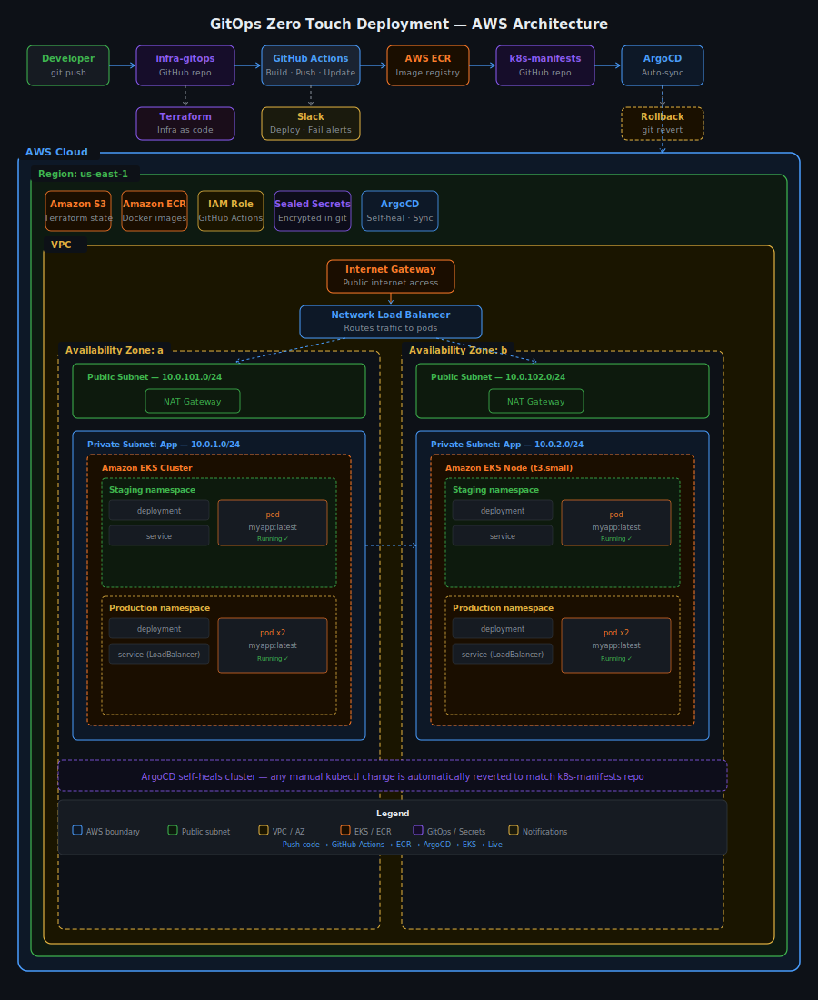

# 🚀 GitOps Infrastructure — Zero Touch Deployment

> A production-grade GitOps pipeline on AWS EKS that automatically deploys, monitors, and rolls back applications when you push code — no manual steps required.

## 🎬 Demo
[▶️ Watch 4-minute live rollback demo on Loom](https://www.loom.com/share/d8b340deea57477196b49a997803bc5c)

## 🏗️ Architecture

<p align="center">
  
</p>

Developer pushes code

↓

GitHub Actions builds Docker image → pushes to ECR

↓

k8s-manifests repo updated automatically

↓

ArgoCD detects change → syncs EKS cluster

↓

Staging deploys first → verify → promote to production

↓

Slack notified at every step

## 🔧 Tech Stack

| Tool | Purpose |
|---|---|
| **AWS EKS** | Kubernetes cluster — runs the application |
| **AWS ECR** | Docker image registry |
| **Terraform** | Infrastructure as code — provisions all AWS resources |
| **ArgoCD** | GitOps engine — auto-syncs cluster to match Git |
| **GitHub Actions** | CI/CD — builds, pushes, updates manifests |
| **Sealed Secrets** | Encrypts secrets so they're safe to commit to Git |
| **Docker** | Containerises the application |
| **Slack** | Real-time deployment and failure notifications |

## 💡 The Problem It Solves

Most teams deploy manually — someone runs `kubectl apply` or `terraform apply` by hand. This creates human error, no audit trail, and slow recovery when things break.

This pipeline makes Git the single source of truth. Push code and everything else happens automatically — build, deploy, notify. Break something? One `git revert` fixes it in under 3 minutes with no server access required.

## 🚀 How to Run It

**Prerequisites:**
- AWS account with CLI configured
- GitHub account
- Docker Desktop installed
- eksctl, kubectl, terraform installed

**Step 1: Clone both repos**
```bash
git clone https://github.com/Akioye/infra-gitops.git
git clone https://github.com/Akioye/k8s-manifests.git
```

**Step 2: Configure GitHub Secrets**

Add these to `infra-gitops` → Settings → Secrets → Actions:
AWS_ACCESS_KEY_ID
AWS_SECRET_ACCESS_KEY
MANIFESTS_TOKEN
SLACK_WEBHOOK_URL

**Step 3: Create S3 bucket for Terraform state**
```bash
aws s3 mb s3://gitops-terraform-state-akioye --region us-east-1
```

**Step 4: Spin up infrastructure**
```bash
./scripts/setup.bat
```
Creates EKS cluster, installs ArgoCD, creates namespaces, and applies all ArgoCD Application resources automatically.

**Step 5: Push a code change**
```bash
# Edit app/index.js
git add .
git commit -m "your change"
git push
```
Watch GitHub Actions → ArgoCD → Slack do the rest automatically.

**Step 6: Destroy when done**
```bash
# Delete load balancers first
aws elb describe-load-balancers --region us-east-1 --query "LoadBalancerDescriptions[].LoadBalancerName" --output table
aws elb delete-load-balancer --load-balancer-name NAME_HERE --region us-east-1

# Then destroy cluster
./scripts/destroy.bat
```

## 📊 Results

| Metric | Result |
|---|---|
| Deployment time | Under 3 minutes from push to live |
| Rollback time | Under 3 minutes with git revert |
| Zero downtime deployments | ✅ Rolling update strategy |
| Full audit trail | ✅ Every change is a Git commit |
| Staging gates production | ✅ Bugs caught before real users |
| Secrets encrypted in Git | ✅ Sealed Secrets |
| Self-healing cluster | ✅ ArgoCD reverts manual changes |

## 📸 Screenshots

**ArgoCD Dashboard — Production Healthy, Staging Synced**


**GitHub Actions — Full Pipeline Green in 22 seconds**


**Slack Notifications — Real Time Deployment Alerts**


**Staging Live on AWS EKS**


**Production Live on AWS EKS**


**AWS EKS — 2 Nodes Running Across Availability Zones**


## 💰 AWS Cost Estimate

Running this project costs approximately **$5-6/day** on AWS.

| Resource | Daily Cost |
|---|---|
| EKS control plane | ~$2.40 |
| 2x t3.small nodes | ~$1.10 |
| NAT Gateway | ~$1.07 |
| 2x Load Balancers | ~$1.20 |
| ECR storage | ~$0.01 |
| **Total** | **~$5.78/day** |

Always destroy infrastructure after each session to avoid unnecessary charges.

## 🧠 What I Learned

- How GitOps works in practice — Git as the single source of truth for both application code and infrastructure
- How ArgoCD self-healing works — any manual `kubectl` change is automatically reverted to match the repo
- How to structure a two-repo GitOps pattern — separating app code from Kubernetes manifests
- How Sealed Secrets encrypts sensitive data so it is safe to commit to a public repository
- How to debug real AWS production errors — CloudFormation stack conflicts, VPC subnet dependencies, KMS key expiry, Kubernetes version upgrade constraints
- How staging and production environments protect real users from broken deployments
- How to implement zero-downtime rollbacks using `git revert` — no server access required

## 🔗 Related

- [k8s-manifests](https://github.com/Akioye/k8s-manifests) — Kubernetes manifests watched by ArgoCD
